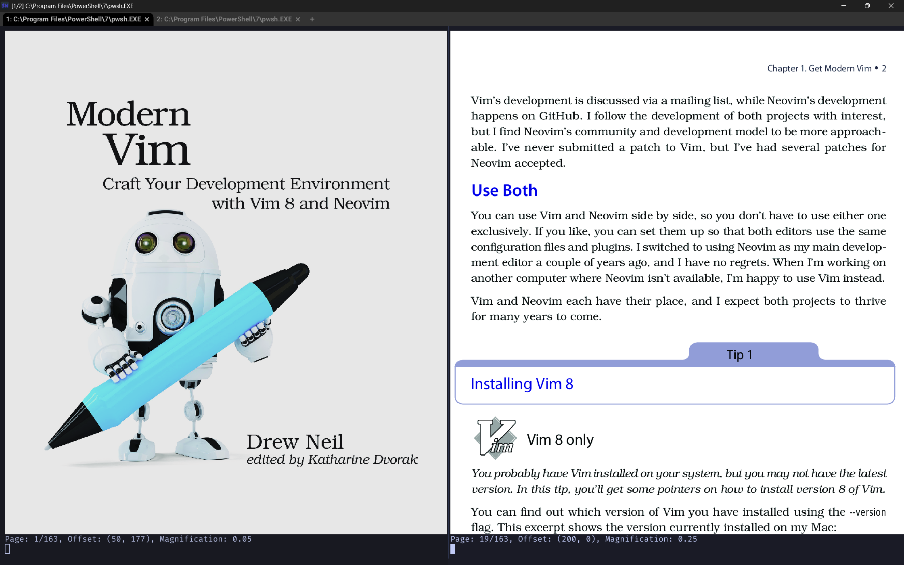

# `livepdf`

Inspired from [`python-imgcat`](https://github.com/wookayin/python-imgcat), use it's imgcat Python API.

Since we can't install `iTerm2` on Windows, it may only work with [`WezTerm`](https://wezfurlong.org/wezterm/imgcat.html) on Windows.




## Requirements

```shell
pip install imgcat wand PyPDF2
```
